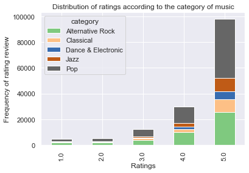
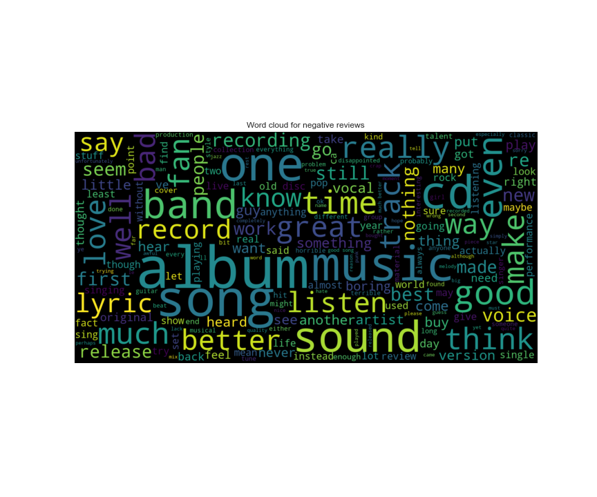

# Amazon-Music-Reviews <!-- omit in toc -->

Amazon has transformed the way we shop and has set high standards with its same day delivery and customer support services. With the transition to onlinw shopping, we rely heavily on images and customer reviews when making a decision on what to buy. 

#### -- Project Status: [Completed]

# Table of Contents <!-- omit in toc -->

- [Synopsis](#synopsis)
- [Dataset](#dataset)
  - [Summary of the Dataset](#summary-of-the-dataset)
  - [Exploratory Analysis](#eda)
- [Sentiment Analysis and Review Prediction](#sentiment)
  - [Multi-class classifcation](#classification)
  - [Neural Networks - LSTM](#lstm)
- [Conclusion](#conclusion)

# Synopsis 

Amazon which was once started as an online book-store is now company with a market cap of over $1.5 Trillion and is posied to grow with its annocuments of entry in the drug distribution and telemedicine industry. The crux of the business however still lies in the online reail businees which has grown at a rapid pace due to the pandemic. 

The purpose of this project is to analyze the review data for products on amazon music and train a sentiment analysis model to predict the user ratings to demonstrate the power of NLP and Neural Networks. 

# Dataset 

The datasets used for this part of the project can be found on Kaggle: 

https://www.kaggle.com/c/mie1624winter2021/data

## Summary of the Dataset 

 - The dataset contains twitter id of user and reviewed products. Textual review, summary and a numerical rating between 1-5. 
 - The price column is however stored as strings and contains text in some cases.
 - The dataset is cleaned by converting the price values to numerical and imputing and missing price value by the median. The textual data from the summary and review is combined and cleaned by removing stop words, punctuations and lemmetizing. 

## Exploratory Analysis 

 - From the plot below, it can be seen that majority of the ratings are 4 or 5. Which contradicts the initial itution that people only go to review something when they find it bad or not up to the mark. This might be a more special case since the data is for musical instruments and usually enthusiasts get something only when they know what they are getting.

  

- Most reviewed genre was Pop followed by Alternative Rock. 

  

- The following are the most reviewed products and the most active users.

  
  
  
  
 - Sentiment distribution of most reviewed products.
 
  
 
- Wordcloud for negative sentiment reviews:
  
  
# Sentiment Analysis and Review Prediction 

Sentiment analysis can be conducted by training a supervised machine learning model on a portion of the review data which can be used to predict a rating that the user might assign just by the analyzing the review text.

## Multi-class classifcation 

In order to do this, a Logistic Regression model and a Multi-class Naive Bayes model is trained on the vectorized review data. The data is vectorized using tf-Idf which counts how frequently a word appears in a review and then penalizes it based on its occurance in the entire set of reviews.

- Logistic Regression model gives a train accuracy of 73%.

  
  
- Naive Bayes model gives a train accuracy of 73%.

  

## Neural Networks - LSTM 

In order to improve on this accuracy a few step are taken:
1. Glove word embeddings are used to vectorize the data. These embeddings are pretrained on a number of features and help classify different words together.
2. A regression type model is used instead of classification. 
3. Neural networks framework in Keras is used with LSTM. Long Short-Term Memory (LSTM) network is a type of RNN capable of learning order dependence in sequence prediction problems. 
4. In addition to the review text, price and genre are also included as features in the NN. Genre is one-hot-encoded and price is standardized for this.

- Proposed LSTM model
  

Hyper-parameter tuning is conduced for the model and then the model is fitted on the train dataset. 

An MSE of 0.42 is obtained for the train set and 0.48 for the test set. 

## Conclusion 

NLP in combination with Neural Networks has made is possible to analyze textual data and train very accurate models to predict sentiments. 

- Predicted Reviews

